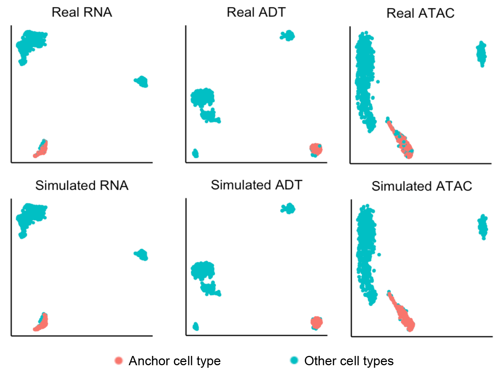
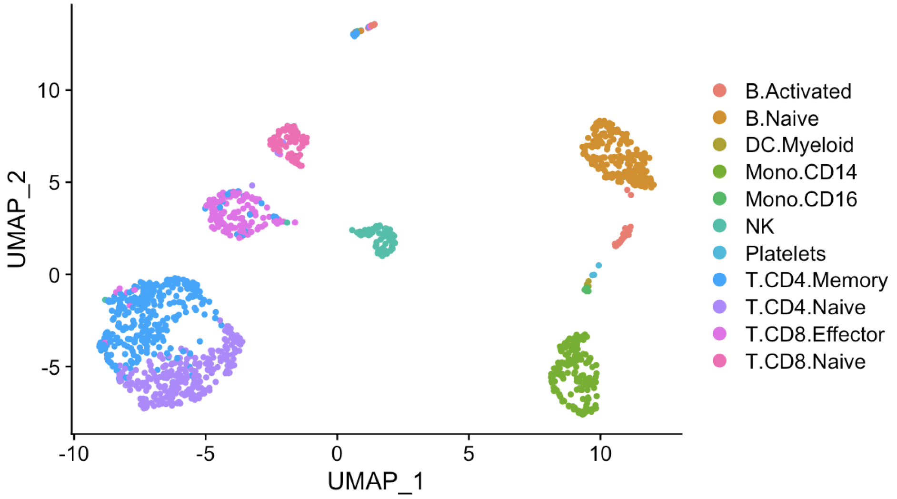
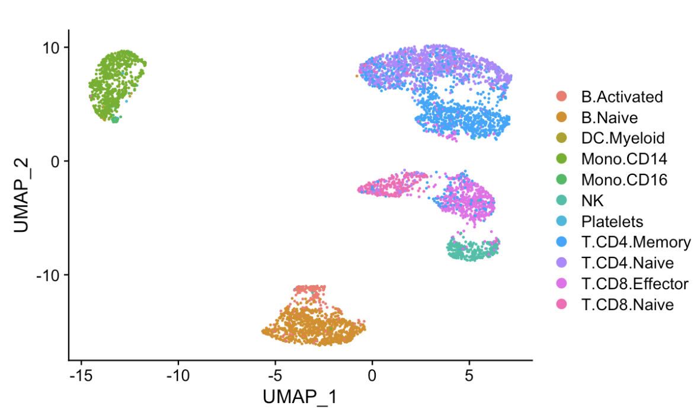

Implement Matilda on CITE-seq Dataset 
========================================

In this tutorial, we go through the basic process of applying Matilda on CITE-seq dataset. The commands below would need to be run in settled conda environment, which could be referred to the :doc:`installation` part.

Envrionment setup
------------------------------------------
::

  cd Matilda
  cd main
  # training the matilda model
  python main_matilda_train.py --rna [trainRNA] --adt [trainADT] --cty [traincty] #[training dataset]
  # Example run
  python main_matilda_train.py --rna ../data/CITEseq/Ctrain_rna.h5 --adt ../data/CITEseq/Ctrain_adt.h5 --cty ../data/CITEseq/Ctrain_cty.csv

Preparing intput for Matilda
------------------------------------------
Recall that Matilda’s main function takes expression data (e.g., RNA, ADT, ATAC) in `.h5` format and cell type labels in `.csv` format. Matilda expects raw count data for RNA and ADT modalities. For ATAC modality, Matilda expects the 'gene activity score' generated by Seurat from raw count data.

An example for creating .h5 file from expression matrix in the R environment is as below ::

  write_h5 <- function(exprs_list, h5file_list) {  
    for (i in seq_along(exprs_list)) {
      h5createFile(h5file_list[i])
      h5createGroup(h5file_list[i], "matrix")
      writeHDF5Array(t((exprs_list[[i]])), h5file_list[i], name = "matrix/data")
      h5write(rownames(exprs_list[[i]]), h5file_list[i], name = "matrix/features")
      h5write(colnames(exprs_list[[i]]), h5file_list[i], name = "matrix/barcodes")
    }  
  }
  write_h5(exprs_list = list(rna = train_rna, h5file_list = "/Matilda/data/CITE-seq/Ctrain_rna.h5")

Example dataset
,,,,,,,,,,,,,,,,,,,,,,

As an example, the processed CITE-seq dataset by Swanson et al待改. (GSE158013待改) is provided for the example run, which is saved in `./Matilda/data/CITEseq`.
You can prepare the example dataset as input for Matilda or use their own datasets.

Running Matilda with the example CITE-seq dataset
----------------------------------------------------

Training the Matilda model with CITE-seq (see Arguments section for more details). 
,,,,,,,,,,,,,,,,,,,,,,,,,,,,,,,,,,,,,,,,,,,,,,,,,,,,,,,,,,,,,,,,,,,,,,,,,,,,,,,,,,,,,,,,,, 

::

  cd Matilda
  cd main
  # training the matilda model
  python main_matilda_train.py --rna [trainRNA] --adt [trainADT] --cty [traincty] #[training dataset]
  # Example run
  python main_matilda_train.py --rna ../data/CITEseq/Ctrain_rna.h5 --adt ../data/CITEseq/Ctrain_adt.h5 --cty ../data/CITEseq/Ctrain_cty.csv

Argument
,,,,,,,,,,,,,,,,,,,,,,,,,,,,,,,,,,,,,,,,,,,,,,,,,,,,,,,,,,,,,,,,,,,,,,,,,,,,,,,,,,,,,,,,,, 

.. note:: Training dataset information
   
   - `--rna`: path to training data RNA modality.

   - `--adt`: path to training data ADT modality.

   - `--cty`: path to the labels of training data.

.. note:: Training and model config
   
   - `--batch_size`: Batch size (set as 64 by default)

   - `--epochs`: Number of epochs.

   - `--lr`: Learning rate.

   - `--z_dim`: Dimension of latent space.

   - `--hidden_rna`: Dimension of RNA branch.

   - `--hidden_adt`: Dimension of ADT branch.

   - `--z_dim`: Dimension of latent space.

.. note:: Other config
   
   - `--seed`: The random seed for training.
   - `--augmentation`: Whether to augment simulated data.

Note: after training, the model will be saved in `./Matilda/trained_model/`.

Perform multiple tasks using trained Matilda model.
------------------------------------------------------------------------------------

After training the model, we can use `main_matilda_task.py` to do multiple tasks with different augments.

Argument for performing tasks
,,,,,,,,,,,,,,,,,,,,,,,,,,,,,,,,,,,,,,,,,,,,,,,,,,,,,,,,,,,,,,,,,,,,,,,,,,,,,,,,,,,,,,,,,, 

+ `--classification`: whether to do cell type classification.
+ `--fs`: whether to do cell type feature selection.
+ `--dim_reduce`: whether to do dimension reduction.
+ `--simulation`: whether to do simulation. 
+ `--simulation_ct`: an integer index for which cell type to simulate. Only be activated when `simulation = True`.
+ `--simulation_num`: the number of cells to simulate for the specified cell type. Only be activated when `simulation = True`.

1) Multi-task on the training data
,,,,,,,,,,,,,,,,,,,,,,,,,,,,,,,,,,,,,,,,,,,,,,,,,,,,,,,,,,,,,,,,,,,,,,,,,,,,,,,,,,,,,,,,,, 
::

  # using the trained model for data simulation
  python main_matilda_task.py  --rna [trainRNA] --adt [trainADT] --cty [traincty] --simulation True --simulation_ct 1 --simulation_num 200
  # Example run
  python main_matilda_task.py --rna ../data/TEAseq/train_rna.h5 --adt ../data/TEAseq/train_adt.h5 --cty ../data/TEAseq/train_cty.csv --simulation True --simulation_ct 1 --simulation_num 200

Output: The output will be saved in `./Matilda/output/simulation_result/TEAseq/reference/`. To generate UMAP plots for the simulated data using R, run `./Matilda/qc/visualize_simulated_data.Rmd`. The UMAPs are:

::

  # using the trained model for data dimension reduction and visualisation
  python main_matilda_task.py  --rna [trainRNA] --adt [trainADT] --cty [traincty] --dim_reduce True
  # Example run
  python main_matilda_task.py --rna ../data/TEAseq/train_rna.h5 --adt ../data/TEAseq/train_adt.h5 --cty ../data/TEAseq/train_cty.csv --dim_reduce True
  
  Output: The output will be saved in `./Matilda/output/dim_reduce/TEAseq/reference/`. To generate UMAP plots and 4 clustering metrices, i.e., ARI, NMI, FM, Jaccard, for the latent space using R, run `./Matilda/qc/visualize_latent_space.Rmd`. The UMAPs are:

::

  # using the trained model for feature selection
  python main_matilda_task.py  --rna [trainRNA] --adt [trainADT] --cty [traincty] --fs True
  # Example run
  python main_matilda_task.py --rna ../data/TEAseq/train_rna.h5 --adt ../data/TEAseq/train_adt.h5 --cty ../data/TEAseq/train_cty.csv --fs True

Output: The output, i.e. feature importance scores, will be saved in `./Matilda/output/marker/TEAseq/reference/`. 

2) Multi-task on the query data
,,,,,,,,,,,,,,,,,,,,,,,,,,,,,,,,,,,,,,,,,,,,,,,,,,,,,,,,,,,,,,,,,,,,,,,,,,,,,,,,,,,,,,,,,, 

::

  # using the trained model for classifying query data
  python main_matilda_task.py  --rna [queryRNA] --adt [queryADT] --cty [querycty] --classification True
  # Example run
  python main_matilda_task.py --rna ../data/TEAseq/test_rna.h5 --adt ../data/TEAseq/test_adt.h5 --cty ../data/TEAseq/test_cty.csv --classification True --query True

Output: The output will be saved in `./Matilda/output/classification/TEAseq/query/`.

::

  # using the trained model for dimension reduction and visualising query data
  python main_matilda_task.py --rna [queryRNA] --adt [queryADT] --cty [querycty] --dim_reduce True
  # Example run
  python main_matilda_task.py  --rna ../data/TEAseq/test_rna.h5 --adt ../data/TEAseq/test_adt.h5 --cty ../data/TEAseq/test_cty.csv --dim_reduce True --query True

Output: The output will be saved in `./Matilda/output/dim_reduce/TEAseq/query/`. To generate UMAP plots and 4 clustering metrices, i.e., ARI, NMI, FM, Jaccard, for the latent space using R, run `./Matilda/qc/visualize_latent_space.Rmd`. The UMAPs are:

::

  # using the trained model for feature selection
  python main_matilda_task.py --rna [queryRNA] --adt [queryADT] --cty [querycty] --fs True
  # Example run
  python main_matilda_task.py  --rna ../data/TEAseq/test_rna.h5 --adt ../data/TEAseq/test_adt.h5 --atac --cty ../data/TEAseq/test_cty.csv  --fs True --query True

Output: The output, i.e. feature importance scores, will be saved in `./Matilda/output/markers/TEAseq/query/`. 

Reference
------------------------------------------------------------------------------------

[1] Ramaswamy, A. et al. Immune dysregulation and autoreactivity correlate with disease severity in
SARS-CoV-2-associated multisystem inflammatory syndrome in children. Immunity 54, 1083–
1095.e7 (2021).

[2] Ma, A., McDermaid, A., Xu, J., Chang, Y. & Ma, Q. Integrative Methods and Practical Challenges
for Single-Cell Multi-omics. Trends Biotechnol. 38, 1007–1022 (2020).

[3] Swanson, E. et al. Simultaneous trimodal single-cell measurement of transcripts, epitopes, and
chromatin accessibility using TEA-seq. Elife 10, (2021).

License
------------------------------------------------------------------------------------

This project is covered under the Apache 2.0 License.
