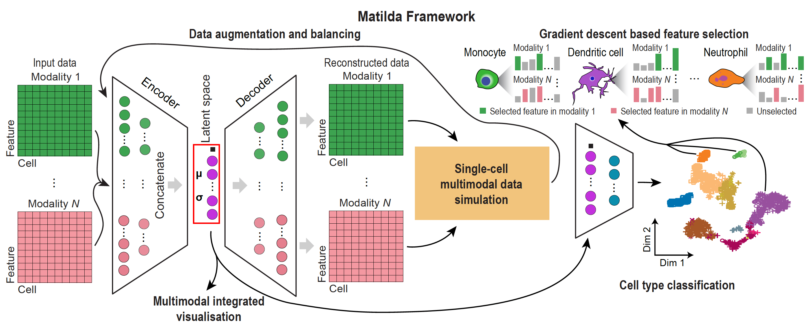

Introduction to the Matilda (Designment)
======================================================

In this introductory tutorial, we go through the different parts of Matilda's designment. More details of the theories and experiments could be reviewed in 

Multi-task learning architecture
--------------------------------------
The multi-task neural networks in Matilda consist of multimodality-specific en coders and decoders in a variational autoencoder (VAE) component for data simulation and afully-connected classification network for cell type classification. The encoders in the VAE component are shareable for both data simulation and classification tasks, and consist of one learnable point wise parameter layer and one fully-connected layer to the input layer. Because ADT modality has significantly fewer features than RNA and ATAC modalities, we set empirically, based on model selection, the numbers of neurons for encoders of RNA, ADT, and ATAC modalities to be 185, 30, and 185, respectively. To learn a latent space that integrates the information from across modalities, we concate nated the output from the encoder trained from each data modality to perform joint learning using a fully-connected layer with 100 neurons, followed by a VAE reparameterization process [1]. Next, the fully-connected layer of the latent space is split into two branches with one branch fed into the decoders and the other branch fed into the fully connected classification network.For the decoder branch, it consists of multiple decoders each corresponds to an input datamodality. Each decoder consists of one fully-connected layer to the output layer that has the same number of neu rons as the features in the corresponding data modality. For each fully-connected layer in the VAE component, batch normalization [2], shortcut [3] were utilized in the model. ReLU activation was used in all fully-connected layers except in the reparameterization process. Dropout (r = 0.2) was utilized only for fully-connected layers in encoders. For the classification branch, it consists of the latent space as input to a fully-connected layer with a dimension equal to the number of cell types in the training data. The fully connected layer outputs a probability vector for cell type prediction through a SoftMax function.

Loss function 
------------------
Let X be the single-cell multimodal omic data from N modalities, the VAE component of Matilda contains two procedures: (i) the encoders encode each modality in the data X individually, and concatenate them for joint learning. This process projected the high dimensional X into a low-dimensional latent space. We denote the posterior distribution of this process as :math:`q_θ (z|X)` , where θ is the learnable parameter of the neural network in this procedure; (ii) the decoders reconstruct the low dimensional latent space to the high-dimensional original data space. We denote the posterior distribution of this pro cess as :math:`p_ϕ(X|z)` , where ϕ is the learnable parameter of the neural network in this procedure. The loss function of the data simulation component can be represented as the negative log-likelihood with a regularizer:

.. math::

    L_{sim}(θ,ϕ)=−E_{z∼q_θ(z|X)}[logp_ϕ(X|z)] + KL(q_θ(z|X)||p(z))     

The first term is the reconstruction loss using the expectation of negative log-likelihood. This term encourages the decoder to learn to reconstruct the original data Xusingthe low-dimensional representation z. The second term is the Kullback-Leibler (KL) divergence between the encoder’s distribution :math:`q_θ (z|X)` and p(z), where p(z) is specified as a standard Normal distribution as p(z) ∼ N(0,1). This divergence measures the information loss when using :math:`q_θ (z|X)` to represent p(z). The encoder network parameters are in turn optimized using stochastic gradient descent via back propagation, which is made possible by the reparameteriza tion trick [1].
For the loss function of the classification component, we use cross-entropy loss with label smoothing [4]. Label smoothing is a regularizer technique, which replaces one hot real label vector yreal with a mixture of yreal and the uniform distribution:

.. math::

    y_{ls} = (1−α) × y_{real} + α/K

where K is the number of label classes, and α is a hyperpa rameter that determines the amount of smoothing. Then, the classification loss can be represented as:

.. math::

    L_{cla} = −\sum_{i=1}^{K}  y_{ls}^i  log  y_{output}^i

where :math:`y_{output}^i` is the predicted label for the ith cell. To learn Matilda, we combined the simulation loss and classification loss to give the following overall loss function:

.. math::

    L_{sum} = L_{sim} + λ × L_{cla}

where λ is a weighting coefficient that determines the importance of the classification term against the data simulation term from Matilda.
Data augmentation and balancing strategy. During the model training process, Matilda performs data augmentation and balancing using simulated data from the VAE component. Specifically, Matilda first ranks the cell types in the training dataset by the number of cells in each type. The cell type corresponding to the median number is used as the reference and those that have smaller numbers of cells are augmented to have the same number of cells as the me dian using VAE simulated single-cell multimodal data for each cell type. Cell types that have larger numbers of cells than the median number are randomly down-sampled to match the median number of cells as well. This strategy helps Matilda to mitigate imbalanced cell type distribution in the data [5] and better learn the molecular features of under-represented and rare cell types.

Joint feature selection from multiple modalities 
------------------------------------------------------
Leveraging its neural network architecture, Matilda implements two approaches, i.e. integrated gradient (IG) [6] descent and saliency [7] based procedures, to detect the most informative features simultaneously from each of all data modalities. Specifically, for the IG method, to assess the importance of each feature, the trained model was used for back propagation of the partial derivatives from the output units of the classification network to the input units of the encoders, where each input unit represents an individual feature from a given modality in the input data X. The importance score of each input feature of each cell is determined by approximating the integral gradients of the model’s output to its input:

.. math::

    S_j = \int_{τ=0}^1 X_j × \pfrac[X_j]{F(τ × X)} dτ

where F represents the classification branch of the multi task neural networks, and :math:`\pfrac[X_j]{F(τ × X)}` is the gradient of F(X) along with the jth feature. We aggregated these derivatives across cells within each cell type. These aggregated gradients indicate the importance of each feature from each data modality in predicting each cell type. The top ranked features from each cell type can be selected based on their aggregated derivatives for subsequent analyses. For the saliency method, a cell-type-specific importance score of a feature j is computed using the derivative:

.. math::

    S_j = \pfrac[X]{F(X)} |_{X_j}

The magnitude of the derivative :math:`S_j` indicates the effect of feature j on the classification score

Matilda model training
--------------------------
Matilda adopts a two-step training strategy. In the first step, i.e. before augmentation and balancing, we train a network from scratch. In the second step, i.e. after augmentation and balancing, we inherit the weights from the first step as the initial value and fine-tune the networks using augmented and balanced data. Several key hyper-parameters may impact the performance of Matilda. These include the number of layers in the neural networks, the number of neurons in each layer, the parameter λ that balances the VAE data reconstruction and cell type classification in the multi-tasking learning, and other parameters such as learning rate, number of epochs, batch size, and dropout rate. To optimize these hyper-parameters, we used the training datasets of CITE seq, SHARE-seq, and TEA-seq to evaluate the model performance with different parameter combinations based on measurements including (a) the distance between the umap of simulated data and real data and (b) the classification accuracy before and after data augmentation. These allowed us to determine the following Matilda settings that were used in subsequent experiments. Specifically, for both steps in the training process, batch size was set to 64 cells in learning from all datasets. The epoch was set to 30 for all datasets except the CITE-seq dataset generated by Hao et al. (GSE164378) which contains the largest number of cells. Since large datasets do not need many training epochs for the neural networks to converge, we set this to 10 for this CITE-seq dataset (GSE164378) for improving training efficiency. The parameter λ for balancing loss function in multitasking learning was empirically set to 0.1 for all datasets and the parameter α in label smoothing was set to 0.1 according to [8]. In the first stage, we empirically determined the learning rate of 0.02 in the training process. In the second stage, we fine-tuned the networks with an initial learning rate of 0.02 for the first half of epochs and 0.002 for the second half of epochs. In Matilda, all input data modalities were normalized by the ‘NormalizeData’ function in Seu rat [9] and then scaled using a z-score transformation to a similar range.

Reference
------------------------------------------------------------------------------------

[1] Kingma,D.P. and Welling,M. (2014) Auto-encoding variational bayes. arXiv doi: https://arxiv.org/abs/1312.6114, 10 December 2022, preprint: not peer reviewed.

[2] Ioffe,S. and Szegedy,C. (2015) Batch normalization: accelerating deep network training by reducing internal covariate shift. arXiv doi: https://arxiv.org/abs/1502.03167, 02 March 2015, preprint: not peer reviewed.

[3] He,K., Zhang,X., Ren,S. and Sun,J. (2016) Deep residual learning for image recognition. In: 2016 IEEE Conference on Computer Vision andPattern Recognition (CVPR). IEEE, Las Vegas, NV, USA, pp. 770–778.

[4] M¨uller,R., Kornblith,S. and Hinton,G. (2020) When does label smoothing help? arXiv doi: https://arxiv.org/abs/1906.02629, 10 June 2020, preprint: not peer reviewed.

[5] He,H. and Garcia,E.A. (2009) Learning from imbalanced data. IEEE Trans. Knowl. Data Eng., 21, 1263–1284.

[6] Sundararajan,M., Taly,A. and Yan,Q. (2017) Axiomatic attribution for deep networks. arXiv doi: https://arxiv.org/abs/1703.01365,13 June 2017, preprint: not peer reviewed.

[7] Simonyan,K., Vedaldi,A. and Zisserman,A. (2014) Deep inside convolutional networks: visualising image classification models and saliency maps. arXiv doi: https://arxiv.org/abs/1312.6034,19April 2014, preprint: not peer reviewed.

[8] Liu,Z., Luo,W., Wu,B., Yang,X., Liu,W. and Cheng,K.-T. (2020) Bi-real net: binarizing deep network towards real-network performance. Int. J. Comput. Vis., 128, 202–219.

[9] Hao,Y., Hao,S., Andersen-Nissen,E., Mauck,W.M., Zheng,S., Butler,A., Lee,M.J., Wilk,A.J., Darby,C., Zager,M. et al. (2021) Integrated analysis of multimodal single-cell data. Cell, 184, 3573–3587.

