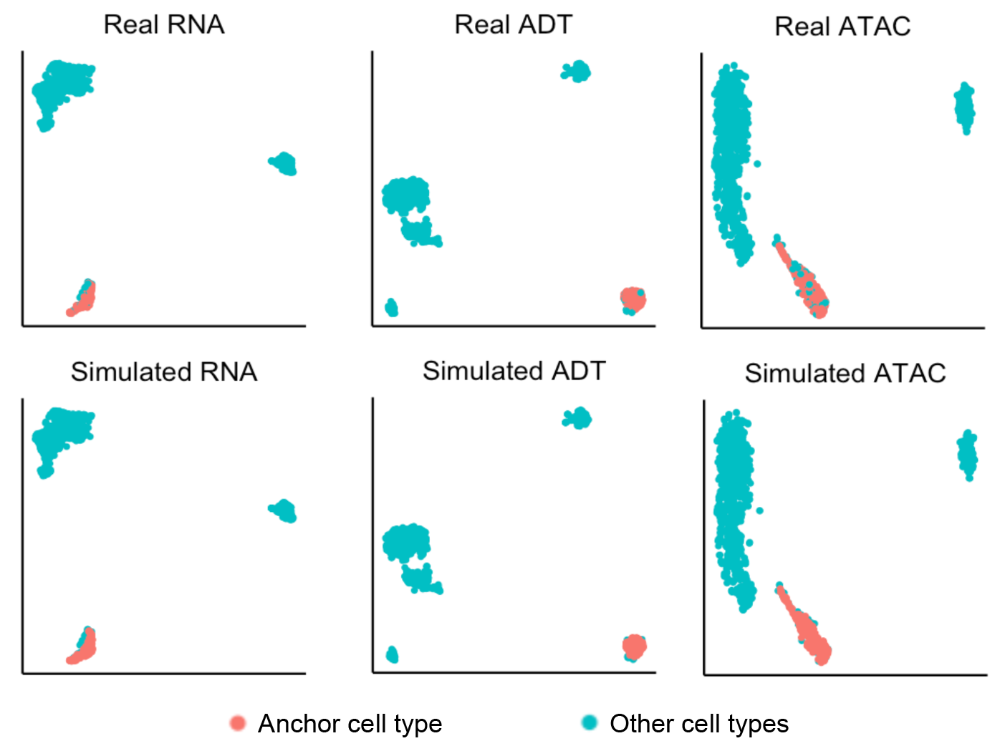
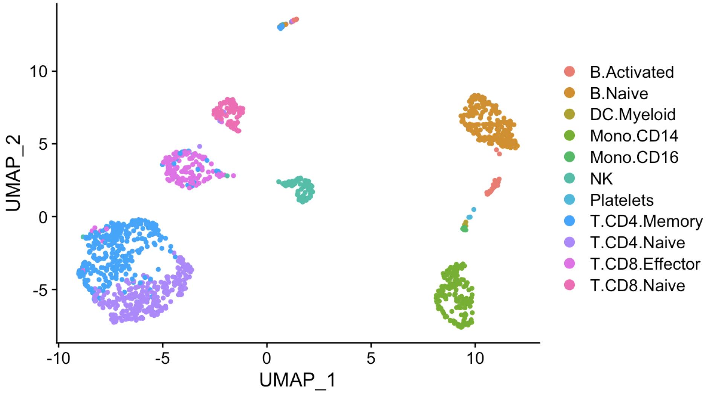
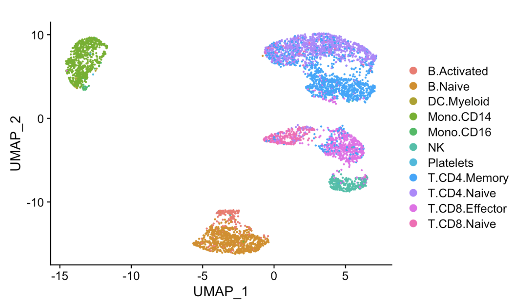

Implementing Matilda 
========================================

In this tutorial, we go through the basic steps for implementing Matilda on multimodal dataset. It is a quick example with specified dataset. The commands below would need to be run in settled conda environment, which could be referred to the :doc:`installation` part. 

.. note::

  There are two kinds of codes for applying Matilda: applying Matilda through shell/Python explainer (e.g. Jupyter notebook), you should use the correct one corresponding to your installation method, which could also be reviewed in :doc:`installation`. 

And there is a complete example for implementing Matilda with only shell's style by coding in (.ipynb) script on the Colab_.

.. _Colab: https://colab.research.google.com/drive/1aSU1Oi0ecBthcG27FvvKodxBg22B7Alo?usp=sharing

Preparing intput for Matilda
------------------------------------------
Matilda’s main function takes expression data (e.g., RNA, ADT, ATAC) in `.h5` format and cell type labels in `.csv` format. Matilda expects raw count data for RNA and ADT modalities. For ATAC modality, Matilda expects the 'gene activity score' generated by Seurat from raw count data.

An example for creating .h5 file from expression matrix in the R environment is as below ::

  write_h5 <- function(exprs_list, h5file_list) {  
    for (i in seq_along(exprs_list)) {
      h5createFile(h5file_list[i])
      h5createGroup(h5file_list[i], "matrix")
      writeHDF5Array(t((exprs_list[[i]])), h5file_list[i], name = "matrix/data")
      h5write(rownames(exprs_list[[i]]), h5file_list[i], name = "matrix/features")
      h5write(colnames(exprs_list[[i]]), h5file_list[i], name = "matrix/barcodes")
    }  
  }
  write_h5(exprs_list = list(rna = train_rna, h5file_list = "/Matilda/data/TEA-seq/train_rna.h5")

An example for creating gene activity score from ATAC modality in the R environment using human gene annotation is as below ::

  gene.activities <- CreateGeneActivityMatrix2(peak.matrix=teaseq.peak,
                                               annotation.file = “Homo_sapiens.GRCh38.90.chr.gtf.gz”,
                                               seq.levels = c(1:22, “X”, “Y”),
                                               seq_replace = c(“:”))

Example dataset
,,,,,,,,,,,,,,,,,,,,,,

As an example, the processed TEA-seq dataset by Swanson et al. (GSE158013) is provided for the example run, which is saved in `./Matilda/data/TEAseq`.

It contain three modalities at the same time. Therefore, the datasets with the same or less modalities (such as CITE-seq, SHARE-seq) could be analysed similarly following with the steps below.

Users can prepare the example dataset as input for Matilda or use their own datasets.
Training and testing on demo dataset will cost no more than 1 minute with GPU.

Running Matilda with the example dataset. 
--------------------------------------------------------------------

Data Processing for Unmatched Training and Test Features

When processing test datasets with unmatched features, it is important to ensure that the test data aligns with the feature set used in training. One approach is to restrict both datasets to their overlapping features, if available::

library(rhdf5)
train <- h5read("/Matilda/data/TEA-seq/train_rna.h5", "matrix/data")
train <- t(train)
colnames(train) <- h5read("/Matilda/data/TEA-seq/train_rna.h5", "matrix/barcodes")
rownames(train) <- h5read("/Matilda/data/TEA-seq/train_rna.h5", "matrix/features")
test <- h5read("/Matilda/data/TEA-seq/test_rna.h5", "matrix/data")
test <- t(test)
colnames(test) <- h5read("/Matilda/data/TEA-seq/test_rna.h5", "matrix/barcodes")
rownames(test) <- h5read("/Matilda/data/TEA-seq/test_rna.h5", "matrix/features")
common_features <- intersect(rownames(train), rownames(test))
train <- train[common_features, ]
test <- test[common_features, ]

Alternatively, users can align the test dataset to the feature space of the training data by retaining shared features and imputing missing ones with zeros as a straightforward strategy::

library(rhdf5)
train <- h5read("/Matilda/data/TEA-seq/train_rna.h5", "matrix/data")
train <- t(train)
colnames(train) <- h5read("/Matilda/data/TEA-seq/train_rna.h5", "matrix/barcodes")
rownames(train) <- h5read("/Matilda/data/TEA-seq/train_rna.h5", "matrix/features")
test <- h5read("/Matilda/data/TEA-seq/test_rna.h5", "matrix/data")
test <- t(test)
colnames(test) <- h5read("/Matilda/data/TEA-seq/test_rna.h5", "matrix/barcodes")
rownames(test) <- h5read("/Matilda/data/TEA-seq/test_rna.h5", "matrix/features")
test_aligned <- matrix(0, nrow = nrow(train), ncol = ncol(test))
rownames(test_aligned) <- rownames(train)
colnames(test_aligned) <- colnames(test)
common_features <- intersect(rownames(train), rownames(test))
test_aligned[common_features, ] <- test[common_features, ]
test <- test_aligned

Training the Matilda model.
,,,,,,,,,,,,,,,,,,,,,,,,,,,,,,,,,,,,,,,,,,,,,,,,,,,,,,,,,,,,,,,,,,,,,,,,,,,,,,,,,,,,,,,,,, 
Install via clonning:
::

  cd Matilda
  cd main
  # training the matilda model
  # python main_matilda_train.py --rna [trainRNA] --adt [trainADT] --atac [trainATAC] --cty [traincty] #[training dataset]
  # Example run
  python main_matilda_train.py --rna ../data/TEAseq/train_rna.h5 --adt ../data/TEAseq/train_adt.h5 --atac ../data/TEAseq/train_atac.h5 --cty ../data/TEAseq/train_cty.csv
  # CITE-seq
  # python main_matilda_train.py --rna ../data/TEAseq/train_rna.h5 --adt ../data/TEAseq/train_adt.h5  --cty ../data/TEAseq/train_cty.csv
  # SHARE-seq
  # python main_matilda_train.py --rna ../data/TEAseq/train_rna.h5 --atac ../data/TEAseq/train_atac.h5 --cty ../data/TEAseq/train_cty.csv

Install via pip:
::

  import matilda

  # training the matilda model
  # matilda.main_matilda_train.main_train(rna,adt,atac,cty)

  # Example run
  rna_path='D:/data/TEAseq/train_rna.h5'
  adt_path='D:/data/TEAseq/train_adt.h5'
  atac_path='D:/data/TEAseq/train_atac.h5'
  cty_path='D:/data/TEAseq/train_cty.csv'

  matilda.main_matilda_train.main_train(rna_path,adt_path,atac_path,cty_path)
  # CITE-seq
  # matilda.main_matilda_train.main_train(rna_path,adt_path,atac_path="NULL",cty_path)
  # SHARE-seq
  # matilda.main_matilda_train.main_train(rna_path,adt_path="NULL",atac_path,cty_path)

Argument 
,,,,,,,,,,,,,,,,,,,,,,,,,,,,,,,,,,,,,,,,,,,,,,,,,,,,,,,,,,,,,,,,,,,,,,,,,,,,,,,,,,,,,,,,,, 
More details could be viewed in :doc:`Hyper-tun` 

.. note::

  The name of arguments are the same no matter which kinds of installation. For example, the hyperparameter 'lr' in the function 'matilda.main_matilda_train.main_train' is equivalent to '--lr' when assigning input in shell.

Training dataset information
   
   - `--rna`: path to training data RNA modality.

   - `--adt`: path to training data ADT modality (can be null if ATAC is provided).

   - `--atac`: path to training data ATAC modality (can be null if ADT is provided). Note ATAC data should be summarised to the gene level as "gene activity score".

   - `--cty`: path to the labels of training data.

Training and model config
   
   - `--batch_size`: Batch size (set as 64 by default)

   - `--epochs`: Number of epochs.

   - `--lr`: Learning rate.

   - `--z_dim`: Dimension of latent space.

   - `--hidden_rna`: Dimension of RNA branch.

   - `--hidden_adt`: Dimension of ADT branch.

   - `--hidden_atac`: Dimension of ATAC branch.

Other config
   
   - `--seed`: The random seed for training.
   - `--augmentation`: Whether to augment simulated data.

After training, the model will be saved in `./Matilda/trained_model/`.

Perform multiple tasks using trained Matilda model. 
------------------------------------------------------------------------------------
After training the model, we can use 'main_matilda_task.py' or function 'matilda.main_matilda_task.main_task()' to do multiple tasks with different augments.

Argument for performing tasks Argument 
,,,,,,,,,,,,,,,,,,,,,,,,,,,,,,,,,,,,,,,,,,,,,,,,,,,,,,,,,,,,,,,,,,,,,,,,,,,,,,,,,,,,,,,,,,, 
More details could be viewed in :doc:`Hyper-tun`

  + `--classification`: whether to do cell type classification.
  + `--fs`: whether to do cell type feature selection.
  + `--dim_reduce`: whether to do dimension reduction.
  + `--simulation`: whether to do simulation. 
  + `--simulation_ct`: an index for which cell type to simulate, could be the real type label. "-1" means to simulate all types. Only be activated when `simulation = True`.
  + `--simulation_num`: the number of cells to simulate for the specified cell type. Only be activated when `simulation = True`.

0) import Matilda & Define the path of Training data, Test data
,,,,,,,,,,,,,,,,,,,,,,,,,,,,,,,,,,,,,,,,,,,,,,,,,,,,,,,,,,,,,,,,,,,,,,,,,,,,,,,,,,,,,,,,,,,,,,,,,,,,
Install via pip:
::

  import matilda

  rna_path='D:/data/TEAseq/train_rna.h5'
  adt_path='D:/data/TEAseq/train_adt.h5'
  atac_path='D:/data/TEAseq/train_atac.h5'
  cty_path='D:/data/TEAseq/train_cty.csv'

  test_rna_path='D:/data/TEAseq/test_rna.h5'
  test_adt_path='D:/data/TEAseq/test_adt.h5'
  test_atac_path='D:/data/TEAseq/test_atac.h5'
  test_cty_path='D:/data/TEAseq/test_cty.csv'

1) Multi-task on the training data
,,,,,,,,,,,,,,,,,,,,,,,,,,,,,,,,,,,,,,,,,,,,,,,,,,,,,,,,,,,,,,,,,,,,,,,,,,,,,,,,,,,,,,,,,, 
i) Data Simulation 

Install via clonning:
::

  # using the trained model for data simulation
  # python main_matilda_task.py  --rna [trainRNA] --adt [trainADT] --atac [trainATAC] --cty [traincty] --simulation True --simulation_ct -1 --simulation_num 200
  # Example run
  python main_matilda_task.py --rna ../data/TEAseq/train_rna.h5 --adt ../data/TEAseq/train_adt.h5 --atac ../data/TEAseq/train_atac.h5 --cty ../data/TEAseq/train_cty.csv --simulation True --simulation_ct -1 --simulation_num 200

Install via pip:
::

  # Using the trained model for data simulation, example:
  matilda.main_matilda_task.main_task(rna_path,adt_path,atac_path,cty_path,simulation=True,simulation_ct="-1",simulation_num=200)

Output: The output will be saved in `./Matilda/output/simulation_result/TEAseq/reference/`. To generate UMAP plots for the simulated data using R, run `./Matilda/qc/visualize_simulated_data.Rmd`. The UMAPs are:

ii) Dimension Reduction 

Install via clonning:
::

  # using the trained model for data dimension reduction and visualisation
  # python main_matilda_task.py  --rna [trainRNA] --adt [trainADT] --atac [trainATAC] --cty [traincty] --dim_reduce True
  # Example run
  python main_matilda_task.py --rna ../data/TEAseq/train_rna.h5 --adt ../data/TEAseq/train_adt.h5 --atac ../data/TEAseq/train_atac.h5 --cty ../data/TEAseq/train_cty.csv --dim_reduce True

Install via pip:
::

  # Using the trained model for data dimension reduction and visualisation, example:
  matilda.main_matilda_task.main_task(rna_path,adt_path,atac_path,cty_path,dim_reduce=True)

Output: The output will be saved in `./Matilda/output/dim_reduce/TEAseq/reference/`. To generate UMAP plots and 4 clustering metrices, i.e., ARI, NMI, FM, Jaccard, for the latent space using R, run `./Matilda/qc/visualize_latent_space.Rmd`. The UMAPs are:

iii) Feature Selection 

Install via clonning:
::

  # using the trained model for feature selection
  # python main_matilda_task.py  --rna [trainRNA] --adt [trainADT] --atac [trainATAC] --cty [traincty] --fs True
  # Example run
  python main_matilda_task.py --rna ../data/TEAseq/train_rna.h5 --adt ../data/TEAseq/train_adt.h5 --atac ../data/TEAseq/train_atac.h5 --cty ../data/TEAseq/train_cty.csv --fs True

Install via pip:
::

  # Using the trained model for feature selection, example:
  matilda.main_matilda_task.main_task(rna_path,adt_path,atac_path,cty_path,fs=True)

Output: The output, i.e. feature importance scores, will be saved in `./Matilda/output/marker/TEAseq/reference/`. 

2) Multi-task on the query data
,,,,,,,,,,,,,,,,,,,,,,,,,,,,,,,,,,,,,,,,,,,,,,,,,,,,,,,,,,,,,,,,,,,,,,,,,,,,,,,,,,,,,,,,,, 

i) Classification 

Install via clonning:
::

  # using the trained model for classifying query data
  # python main_matilda_task.py  --rna [queryRNA] --adt [queryADT] --atac [queryATAC] --cty [querycty] --classification True
  # Example run
  python main_matilda_task.py --rna ../data/TEAseq/test_rna.h5 --adt ../data/TEAseq/test_adt.h5 --atac ../data/TEAseq/test_atac.h5 --cty ../data/TEAseq/test_cty.csv --classification True --query True

Install via pip:
::

  # Using the trained model for classifying query data, example:
  matilda.main_matilda_task.main_task(test_rna_path,test_adt_path,test_atac_path,test_cty_path,classification=True,query=True)

Output: The output will be saved in `./Matilda/output/classification/TEAseq/query/`.

::

  cell ID:  0 	 	 real cell type: T.CD4.Memory 	 	 predicted cell type: T.CD4.Naive 	 	 probability: 0.77
  cell ID:  1 	 	 real cell type: B.Activated 	 	   predicted cell type: B.Activated 	 	 probability: 0.53
  cell ID:  2 	 	 real cell type: B.Naive 	 	       predicted cell type: B.Naive 	 	     probability: 0.73
  cell ID:  3 	 	 real cell type: T.CD4.Naive 	 	   predicted cell type: T.CD4.Naive 	 	 probability: 0.78
  cell ID:  4 	 	 real cell type: T.CD4.Memory 	 	 predicted cell type: T.CD4.Memory 	 	 probability: 0.87
  cell ID:  5 	 	 real cell type: Mono.CD14 	 	     predicted cell type: Mono.CD14 	 	   probability: 0.95
  cell ID:  6 	 	 real cell type: B.Naive 	 	       predicted cell type: B.Naive 	 	     probability: 0.78
  cell ID:  7 	 	 real cell type: Mono.CD14 	 	     predicted cell type: Mono.CD14 	 	   probability: 0.96
  cell ID:  8 	 	 real cell type: T.CD8.Effector 	 predicted cell type: T.CD8.Effector 	 probability: 0.95
……

::

  cell type ID:  0                 cell type: B.Activated          prec : tensor(72.2454, device='cuda:0') number: 180
  cell type ID:  1                 cell type: B.Naive              prec : tensor(98.1400, device='cuda:0') number: 802
  cell type ID:  2                 cell type: DC.Myeloid           prec : tensor(40., device='cuda:0') number: 11
  cell type ID:  3                 cell type: Mono.CD14            prec : tensor(98.6156, device='cuda:0') number: 639
  cell type ID:  4                 cell type: Mono.CD16            prec : tensor(74.1379, device='cuda:0') number: 37
  cell type ID:  5                 cell type: NK                   prec : tensor(97.1820, device='cuda:0') number: 283
  cell type ID:  6                 cell type: Platelets            prec : tensor(45.4545, device='cuda:0') number: 12
  cell type ID:  7                 cell type: T.CD4.Memory         prec : tensor(73.3831, device='cuda:0') number: 1189
  cell type ID:  8                 cell type: T.CD4.Naive          prec : tensor(76.2363, device='cuda:0') number: 1020
  cell type ID:  9                 cell type: T.CD8.Effector       prec : tensor(83.4451, device='cuda:0') number: 576
  cell type ID:  10                cell type: T.CD8.Naive          prec : tensor(84.5635, device='cuda:0') number: 299

ii) Dimension Reduction 

Install via clonning:
::

  # using the trained model for dimension reduction and visualising query data
  # python main_matilda_task.py --rna [queryRNA] --adt [queryADT] --atac [queryATAC] --cty [querycty] --dim_reduce True
  # Example run
  python main_matilda_task.py  --rna ../data/TEAseq/test_rna.h5 --adt ../data/TEAseq/test_adt.h5 --atac ../data/TEAseq/test_atac.h5 --cty ../data/TEAseq/test_cty.csv --dim_reduce True --query True

Install via pip:
::

  # using the trained model for dimension reduction and visualising query data, example:
  matilda.main_matilda_task.main_task(test_rna_path,test_adt_path,test_atac_path,test_cty_path,dim_reduce=True,query=True)

Output: The output will be saved in `./Matilda/output/dim_reduce/TEAseq/query/`. To generate UMAP plots and 4 clustering metrices, i.e., ARI, NMI, FM, Jaccard, for the latent space using R, run `./Matilda/qc/visualize_latent_space.Rmd`. The UMAPs are:

iii) Feature Selection 

Install via clonning:
::

  # using the trained model for feature selection
  # python main_matilda_task.py --rna [queryRNA] --adt [queryADT] --atac [queryATAC] --cty [querycty] --fs True
  # Example run
  python main_matilda_task.py  --rna ../data/TEAseq/test_rna.h5 --adt ../data/TEAseq/test_adt.h5 --atac ../data/TEAseq/test_atac.h5 --cty ../data/TEAseq/test_cty.csv  --fs True --query True

Install via pip:
::

  # using the trained model for feature selection
  matilda.main_matilda_task.main_task(test_rna_path,test_adt_path,test_atac_path,test_cty_path,fs=True,query=True)

Output: The output, i.e. feature importance scores, will be saved in `./Matilda/output/markers/TEAseq/query/`. 

Reference
------------------------------------------------------------------------------------

[1] Ramaswamy, A. et al. Immune dysregulation and autoreactivity correlate with disease severity in
SARS-CoV-2-associated multisystem inflammatory syndrome in children. Immunity 54, 1083–
1095.e7 (2021).

[2] Ma, A., McDermaid, A., Xu, J., Chang, Y. & Ma, Q. Integrative Methods and Practical Challenges
for Single-Cell Multi-omics. Trends Biotechnol. 38, 1007–1022 (2020).

[3] Swanson, E. et al. Simultaneous trimodal single-cell measurement of transcripts, epitopes, and
chromatin accessibility using TEA-seq. Elife 10, (2021).

License
------------------------------------------------------------------------------------

This project is covered under the Apache 2.0 License.
