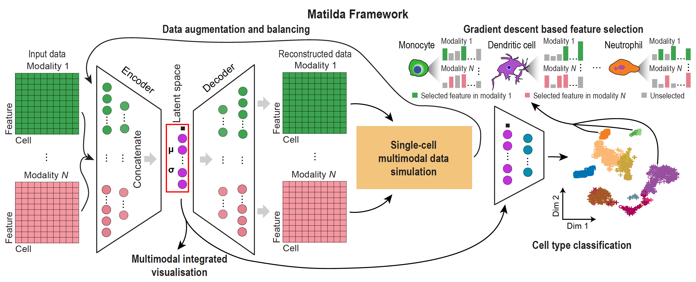

Introduction to the Matilda (Designment)
======================================================

In this introductory tutorial, we go through the different parts of Matilda's designment.

Multi-task learning architecture. 
--------------------------------------
The multi-task neural networks in Matilda consist of multimodality-specific en coders and decoders in a variational autoencoder (VAE) componentfordatasimulationandafully-connectedclassi f ication network for cell type classification. The encoders in the VAEcomponent are shareable for both data simulation and classification tasks, and consist of one learnable point wise parameter layer and one fully-connected layer to the input layer. Because ADT modality has significantly fewer features than RNA and ATAC modalities, we set empiri cally, based on model selection, the numbers of neurons for encoders of RNA, ADT, and ATAC modalities to be 185, 30, and 185, respectively. To learn a latent space that inte grates the information from across modalities, we concate nated the output from the encoder trained from each data modality to perform joint learning using a fully-connected layer with 100 neurons, followed by a VAE reparameteri zation process (11). Next, the fully-connected layer of the latent space is split into two branches with one branch fed into the decoders and the other branch fed into the fully connectedclassification network.Forthedecoderbranch,it consists of multiple decoders each corresponds to an input datamodality.Eachdecoderconsistsofonefully-connected layer to the output layer that has the same number of neu rons as the features in the corresponding data modality. For each fully-connected layer in the VAE component, batch normalization (18), shortcut (19) were utilized in the model. ReLU activation was used in all fully-connected layers ex cept in the reparameterization process. Dropout (r = 0.2) was utilized only for fully-connected layers in encoders. For the classification branch, it consists of the latent space as input to a fully-connected layer with a dimension equal to the number of cell types in the training data. The fully connected layer outputs a probability vector for cell type prediction through a SoftMax function.

Loss function. 
------------------
Let X be the single-cell multimodal omic data from N modalities, the VAE component of Matilda contains two procedures: (i) the encoders encode each modality in the data X individually, and concatenate them for joint learning. This process projected the high dimensional X into a low-dimensional latent space. We de note the posterior distribution of this process as qθ(z|X), where θ is the learnable parameter of the neural network in this procedure; (ii) the decoders reconstruct the low dimensional latent space to the high-dimensional original data space. We denotethe posterior distribution of this pro cess as pϕ(X|z), where ϕ is the learnable parameter of the neural network in this procedure. The loss function of the data simulation component can be represented as the nega tive log-likelihood with a regularizer:

